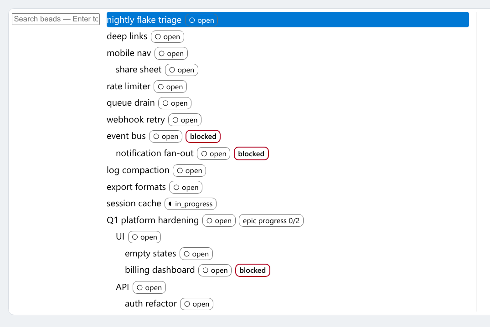
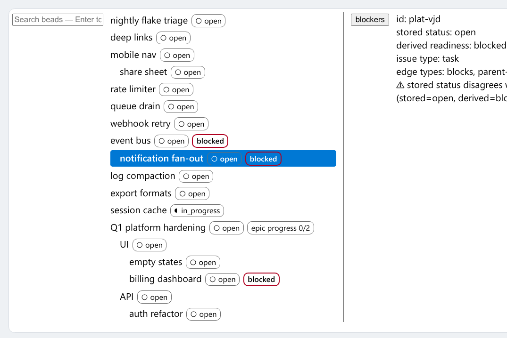
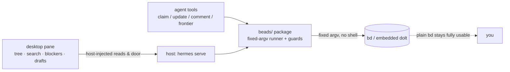
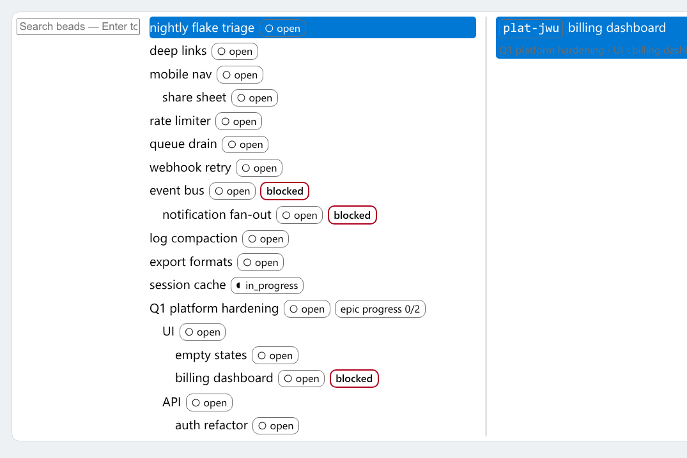
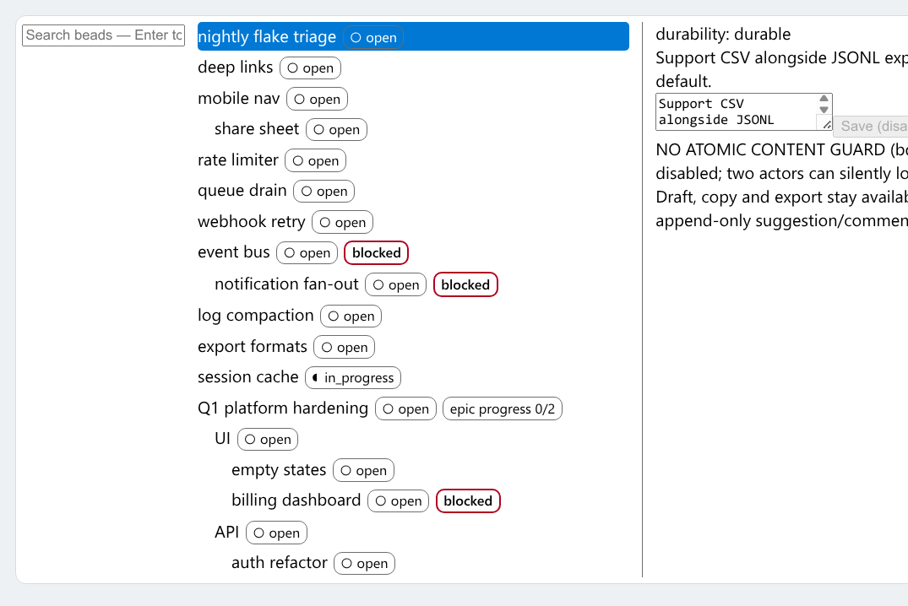

# Hermes Beads workbench

**The work graph your team keeps in a spreadsheet — now native on [bd](https://github.com/steveyegge/beads), wired into [Hermes Agent](https://github.com/NousResearch/hermes-agent).**

One authoritative graph of tasks, blockers, and claims. Agents and humans read
the same `bd ready` / `bd show` state; the plugin gives agents honest tools
over it and gives humans a live pane in Hermes Desktop. Plain `bd` stays fully
sufficient on its own — the plugin only lowers agent effort, never gates what
`bd` can do.



Click any row and the blocker card traces *why* it's blocked — the direct
blockers and the ones inherited through parents, with a breadcrumb home:



## What you get

| | |
|---|---|
| **Agent tools** | `beads_frontier` (scoped ready rows, epics excluded), `beads_show`, `beads_claim` (claim with read-back — two agents never share a bead), `beads_update` (guarded metadata writes), `beads_comment` (append-only), `beads_smoke` |
| **Fixed argv** | every bd call is a fixed argv list — no shell, no interpolation; hostile ids are refused before spawn, and exit codes keep their meaning (13 means *stale guard, nothing written*, never "success") |
| **Honest failures** | named errors, never an empty list dressed up as "nothing to do"; a lost claim names the holder instead of retrying blindly |
| **The pane** | Hermes Desktop tree with search, blocker jumps (direct and inherited), claim buttons, and a draft editor whose changes only land through the bot door — the panel never writes behind `bd`'s back |
| **Escape hatch intact** | uninstall the plugin and `bd` alone still does everything; nothing here locks your data into a private format or daemon |

## Install — two tiers

Full contract with the tier-2 patch snippet: **[docs/install.md](docs/install.md)**.

### Tier 1 — happy path (stock core; pane absent, honestly)

```sh
hermes plugins install jacobhausler/hermes-beads
hermes plugins enable hermes-beads
```

Restart the backend (`hermes serve`) so the tools mount. Requirements:

- **bd 1.3.0+**, configured by the operator — on `PATH`, or
  `HERMES_BEADS_BD_BIN=/path/to/bd` in the backend's environment (the tools
  never take a binary path from the model) — [releases](https://github.com/steveyegge/beads/releases)
  (`brew install beads`, or grab a tarball; verify against `checksums.txt`)
- Hermes Agent ≥ 0.21 (stock — **no patched core required**)
- Python 3, stdlib only; Node only for the pane's tests

You get the six `beads_*` agent tools and their rich JSON cards. The desktop
pane is **not part of this tier**: no `desktop/plugin.js` registered through
`@hermes/plugin-sdk` ships today, so Hermes Desktop does not load the pane —
nothing about it "helpfully arrives" behind your back. Verify it yourself:
`scripts/verify-tier1.sh` enables the plugin into a throwaway `HERMES_HOME`
under `$TMPDIR`, proves the tools mount and the pane stays absent, and scans
the shipped docs for false pane tells (this runs in CI).

Then ask your agent: *"show me the ready frontier in ~/code/myproj"* →
`beads_frontier` answers with what `bd ready` sees, epics excluded.

### Tier 2 — full features (OPTIONAL Hermes Desktop patch; documented only)

Want the workbench pane? It exists and is fully tested under `node --test`,
but it only runs when Hermes Desktop loads it — and that needs an optional,
**version-pinned patch to Hermes Desktop** exposing the plugin-SDK entry
point that wires `desktop/*.mjs` to the host-injected reads/provider/
telemetry/botView (`desktop/workbench.mjs:45-58`). The patch is documented —
pinned to Hermes Desktop v2026.9.24, with update/reset restore notes — in
[docs/install.md](docs/install.md); the real `desktop/plugin.js` entry point
is a stated follow-up slice. Until it merges, Tier 2 is a proposal, not a
supported install.

## How it's built



Two rules fall out of that picture:

- **Everything crosses one boundary.** `beads/native.py` is the only place a
  process spawns. Fixed argv, an explicit store path and actor every time, and
  an exit-code map that mirrors what bd actually does — so a masked failure
  can't turn into a quiet "success".
- **The pane is a view, not a writer.** Reads arrive injected; anything that
  mutates goes through the plugin door or refuses visibly. Delete the plugin
  directory and your beads are exactly as reachable by `bd` as before.

## Search and drafts

`beads_frontier` answers "what can I pick up" in one bounded call; the pane's
search box rides the same read facade, and the draft editor stages title/
acceptance edits that only land through the bot door:





## Status and honesty

Claim atomicity is **non-atomic** by design on bd 1.3.0 (claim, then read back
and verify — a race is *detected*, not prevented); guarded writes rely on bd's
native `--if-assignee`/`--if-status` guards; content replacement (title/
description rewrite) is deliberately **unsupported** through the plugin — edit
content with `bd` directly. The plugin ships no close/reopen verb: closure is
plain `bd close`, always has been.

The pane's Write button stays disabled until a qualified runner door exists;
drafts and Ask/Refine are the shipped surface.

## For agents and contributors

`AGENTS.md` is the front door: repo map, test contract, and the rules that keep
the tree publishable. The suite is stdlib-only — no pip installs, no mocks
against the boundary (the tests run a **real bd binary** against disposable
stores):

```sh
# Python half (needs bd on PATH, e.g. BEADS_LAB_BD=/path/to/bd)
for t in tests/test_*.py; do python3 "$t" || exit 1; done

# Desktop half (Node built-in test runner)
node --test tests/test_*.mjs
```

Both halves run in CI (GitHub Actions) against a pinned Hermes commit;
`hermes plugins validate .` is the admission gate.

## License

MIT — see [LICENSE](LICENSE).
